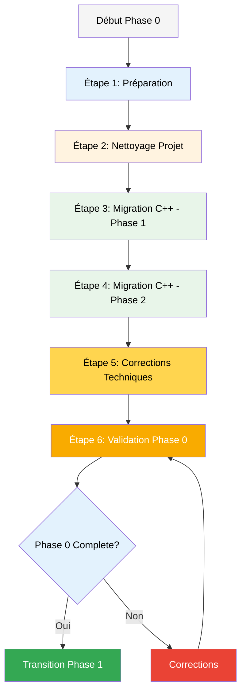

# Workflow BMad - Phase 0: Fondations

**Version:** 1.0
**Date:** 2026-02-19
**Phase:** Phase 0 - Fondations (Migration C++ + Nettoyage)
**Durée estimée:** 2-3 semaines

**Navigation Vault:** [[_ai/00_Home]] | [[_ai/01_Now]] | [[_ai/AGENT_CONTEXT]]
**Liens relies:** [[ROADMAP]] | [[IMPACT_MIGRATION]] | [[SPECS_TECHNIQUES]] | [[_maps/MOC_Execution]]

---

## Vue d'Ensemble du Workflow



---

## Étape 1: Préparation (Jour 1)

### 1.1 Validation Architecture

**Agent:** `/architect`

**Objectifs:**
- Valider ARCHITECTURE.md
- Valider SPECS_TECHNIQUES.md
- Vérifier la cohérence avec les best practices UE5

**Actions:**
```bash
# Lancer l'agent architect
/architect

# Lui demander de:
# 1. Analyser Documentation/ARCHITECTURE.md
# 2. Vérifier la structure C++ proposée
# 3. Valider les dépendances modules (SpaceLeague.Build.cs)
# 4. Confirmer la stratégie de réplication réseau
```

**Livrables:**
- [ ] ARCHITECTURE.md validé
- [ ] SPECS_TECHNIQUES.md validé
- [ ] Liste des dépendances UE5 confirmée
- [ ] Rapport d'architecture (docs/architecture-review.md)

### 1.2 Analyse des Risques de Migration

**Agent:** `/risk-profile`

**Objectifs:**
- Analyser IMPACT_MIGRATION.md
- Identifier les points critiques
- Prioriser les migrations

**Actions:**
```bash
/risk-profile

# Analyser:
# - BP_Paradoxe (CRITIQUE - logique gameplay)
# - BP_Ball (HAUTE - physique)
# - BP_GameMode_SpaceLeague (CRITIQUE - architecture)
# - GI_SpaceLeague (HAUTE - persistance)
```

**Livrables:**
- [ ] Profil de risques créé
- [ ] Ordre de migration optimisé
- [ ] Plan de rollback documenté

### 1.3 Créer Plan de Test Global

**Task:** `/test-design`

**Objectifs:**
- Créer la stratégie de test pour Phase 0
- Définir les critères de validation

**Actions:**
```bash
/test-design

# Créer tests pour:
# 1. Compilation C++/Blueprint
# 2. Lancement sans crash
# 3. Mouvements de base
# 4. Physique de la balle
# 5. Affichage du score
```

**Livrables:**
- [ ] docs/qa/phase0-test-plan.md créé
- [ ] Critères d'acceptance définis
- [ ] Tests automatisés identifiés

---

## Étape 2: Nettoyage Projet (Jour 2)

### 2.1 Tickets LEAG-001 à LEAG-004

**Agent:** `/dev`

**Tickets:**
| Ticket | Description | Priorité |
|--------|-------------|----------|
| LEAG-001 | Supprimer BP_ParadoxeJhin | Haute |
| LEAG-002 | Supprimer BP_ParadoxeSenna | Haute |
| LEAG-003 | Supprimer dossier /Old/ | Moyenne |
| LEAG-004 | Résoudre doublon GI_SpaceLeague | Haute |

**Actions:**
```bash
# Pour chaque ticket:
/dev

# 1. LEAG-001: Supprimer BP_ParadoxeJhin
# - Vérifier qu'il n'est pas référencé ailleurs
# - Utiliser /ue5-health-check --report pour verifier references/doublons
# - Supprimer le fichier

# 2. LEAG-002: Supprimer BP_ParadoxeSenna
# - Même procédure

# 3. LEAG-003: Supprimer dossier /Old/
# - Backup d'abord dans .old/
# - Supprimer Content/Old/

# 4. LEAG-004: Résoudre doublon GI_SpaceLeague
# - Identifier les 2 instances
# - Fusionner ou supprimer
# - Mettre à jour les références
```

**Validation:**
```bash
/qa

# Vérifier:
# - Projet compile
# - Aucune référence cassée
# - Jeu lance sans erreur
```

**Livrables:**
- [ ] BP_ParadoxeJhin supprimé
- [ ] BP_ParadoxeSenna supprimé
- [ ] Dossier /Old/ supprimé
- [ ] GI_SpaceLeague unique
- [ ] Tests de compilation OK

---

## Étape 3: Migration C++ - Phase 1 (Jours 3-5)

### 3.1 Créer Module C++ (LEAG-005)

**Agent:** `/dev`

**Actions:**
```bash
/ue5-create-module SpaceLeague

# Ou manuellement:
# 1. Créer dossier Source/SpaceLeague/
# 2. Créer SpaceLeague.Build.cs
# 3. Créer SpaceLeague.h et SpaceLeague.cpp
# 4. Ajouter au .uproject
```

**Validation:**
```bash
/ue5-compile

# Vérifier:
# - Module compile
# - Visible dans l'éditeur
```

### 3.2 Créer Classes Framework (LEAG-006 à LEAG-009)

**Agent:** `/dev`

**Pour chaque classe:**

#### LEAG-006: ASpaceLeagueGameMode
```bash
/dev

# 1. Créer SpaceLeagueGameMode.h/.cpp
# 2. Copier le code de SPECS_TECHNIQUES.md
# 3. Compiler
# 4. Tester

/ue5-compile
/qa
```

#### LEAG-007: ASpaceLeagueGameState
```bash
/dev

# 1. Créer SpaceLeagueGameState.h/.cpp
# 2. Implémenter réplication (bNetLoadOnClient=true)
# 3. Ajouter GetLifetimeReplicatedProps
# 4. Compiler

/ue5-compile
/qa
```

#### LEAG-008: ASpaceLeaguePlayerController
```bash
/dev

# 1. Créer SpaceLeaguePlayerController.h/.cpp
# 2. Implémenter Enhanced Input
# 3. Compiler

/ue5-compile
```

#### LEAG-009: ASpaceLeagueCharacterBase
```bash
/dev

# 1. Créer SpaceLeagueCharacterBase.h/.cpp
# 2. Implémenter mouvements (Sprint, Dash, Jump, Grappin)
# 3. Ajouter réplication
# 4. Compiler

/ue5-compile
/test-design  # Créer tests mouvements
/qa
```

**Livrables:**
- [ ] Module SpaceLeague créé
- [ ] ASpaceLeagueGameMode implémenté
- [ ] ASpaceLeagueGameState implémenté
- [ ] ASpaceLeaguePlayerController implémenté
- [ ] ASpaceLeagueCharacterBase implémenté
- [ ] Tous les tests passent

---

## Étape 4: Migration C++ - Phase 2 (Jours 6-8)

### 4.1 Reparenter BP_Paradoxe (LEAG-010)

**Agent:** `/dev`

**Actions critiques:**
```bash
# ATTENTION: Sauvegarde obligatoire!
/ue5-backup-asset Content/Legends/BP_Paradoxe.uasset

/dev

# 1. Ouvrir BP_Paradoxe dans l'éditeur
# 2. File > Reparent Blueprint
# 3. Choisir ASpaceLeagueCharacterBase
# 4. Résoudre les conflits de variables
# 5. Tester les mouvements
# 6. Sauvegarder

/qa
# Vérifier:
# - Mouvements fonctionnent
# - Stats persistent
# - Pas de régression
```

**Checklist Migration:**
- [ ] Backup créé
- [ ] Reparentage effectué
- [ ] Variables migrées
- [ ] Mouvements testés
- [ ] Aucune régression

### 4.2 Créer ABall C++ (LEAG-011)

**Agent:** `/dev`

```bash
/dev

# 1. Créer Ball.h/.cpp
# 2. Implémenter physique (UStaticMeshComponent)
# 3. Ajouter réplication (bReplicateMovement=true)
# 4. Compiler

/ue5-compile
```

### 4.3 Reparenter BP_Ball (LEAG-012)

**Agent:** `/dev`

```bash
/ue5-backup-asset Content/Terrain/Blueprints/BP_Ball.uasset

/dev

# Reparenter vers ABall
# Tester physique
# Vérifier réplication

/qa
```

### 4.4 Créer AGoal et APrison (LEAG-013, LEAG-014)

**Agent:** `/dev`

```bash
/dev

# LEAG-013: AGoal
# 1. Créer Goal.h/.cpp
# 2. Implémenter overlap events
# 3. Compiler

# LEAG-014: APrison
# 1. Créer Prison.h/.cpp
# 2. Implémenter prison logic
# 3. Compiler

/ue5-compile
/qa
```

**Livrables:**
- [ ] BP_Paradoxe reparenté
- [ ] ABall créé et testé
- [ ] BP_Ball reparenté
- [ ] AGoal implémenté
- [ ] APrison implémenté

---

## Étape 5: Corrections Techniques (Jours 9-10)

### 5.1 Implémenter GI_SpaceLeague (LEAG-015)

**Agent:** `/dev`

**Actions:**
```bash
/dev

# Ouvrir GI_SpaceLeague Blueprint
# Implémenter fonctions manquantes:
# - InitializeGameData()
# - LoadLegendRegistry()
# - GetLegendDataByID()
# - SavePlayerProgress()
```

**Validation:**
```bash
/qa

# Tester:
# - Chargement des DA_LegendBase
# - Persistance des données
```

### 5.2 Configurer Map Principale (LEAG-016)

**Agent:** `/dev`

```bash
/dev

# 1. Ouvrir L_MainArena
# 2. Ajouter PlayerStart pour Team 1 (2 spawns)
# 3. Ajouter PlayerStart pour Team 2 (2 spawns)
# 4. Configurer World Settings:
#    - GameMode: BP_GameMode_SpaceLeague
#    - PlayerController: BP_SpaceLeaguePlayerController
# 5. Placer BP_Ball
# 6. Placer BP_Goal (Team 1 et 2)
# 7. Placer BP_Prison (Team 1 et 2)

/qa
# Lancer PIE (Play In Editor)
# Vérifier spawn correct
```

### 5.3 Vérifier DA_LegendRegistry (LEAG-017)

**Agent:** `/qa`

```bash
/qa

# Vérifier:
# - DA_LegendBase_Raijin référencé
# - DA_LegendBase_Keplar référencé
# - Aucun asset manquant
# - Stats cohérentes
```

**Livrables:**
- [ ] GI_SpaceLeague fonctionnel
- [ ] Map configurée avec spawns
- [ ] DA_LegendRegistry validé

---

## Étape 6: Validation Phase 0 (Jours 11-12)

### 6.1 QA Gate

**Agent:** `/qa-gate`

**Critères de Validation Phase 0:**

```bash
/qa-gate

# Vérifier TOUS les critères:
```

**Checklist Complète:**
- [ ] Projet compile sans erreur (C++ et Blueprint)
- [ ] Jeu lance sans crash
- [ ] Mouvements de base fonctionnent
  - [ ] Sprint
  - [ ] Saut
  - [ ] Dash
  - [ ] Dash mural
  - [ ] Grappin
- [ ] Balle physique fonctionne
  - [ ] Collision avec joueurs
  - [ ] Collision avec murs
  - [ ] Réplication réseau
- [ ] Score s'affiche
  - [ ] UI visible
  - [ ] Score incrémente correctement

### 6.2 Tests de Régression

**Agent:** `/qa`

```bash
/qa

# Exécuter tests automatisés
/ue5-test

# Tests manuels:
# 1. Lancer en PIE (1 joueur)
# 2. Tester tous les mouvements
# 3. Interagir avec la balle
# 4. Vérifier UI
# 5. Lancer en PIE (2 joueurs split-screen)
# 6. Vérifier réplication
```

### 6.3 NFR Assessment

**Task:** `/nfr-assess`

```bash
/nfr-assess

# Vérifier:
# - Performance (60+ FPS)
# - Temps de compilation (<5 min)
# - Taille du build
# - Utilisation mémoire
```

### 6.4 Documentation Finale

**Task:** `/document-project`

```bash
/document-project

# Mettre à jour:
# - ROADMAP.md (Phase 0 → Complete)
# - ARCHITECTURE.md (si changements)
# - Créer PHASE0_RAPPORT.md
```

**Livrables:**
- [ ] QA Gate passé
- [ ] Tous les tests OK
- [ ] NFR validés
- [ ] Documentation à jour
- [ ] PHASE0_RAPPORT.md créé

---

## Étape 7: Commit et Transition

### 7.1 Commit Final Phase 0

```bash
# Git workflow
git status
git add .
git commit -m "Phase 0 Complete: Migration C++ et Fondations

- Nettoyage projet (LEAG-001 à LEAG-004)
- Module SpaceLeague créé (LEAG-005)
- Classes framework C++ (LEAG-006 à LEAG-009)
- Migration BP_Paradoxe, BP_Ball (LEAG-010 à LEAG-014)
- Corrections techniques (LEAG-015 à LEAG-017)
- QA Gate passé
- Tous les critères Phase 0 validés

Co-Authored-By: Claude Sonnet 4.5 <noreply@anthropic.com>"

git push origin main
```

### 7.2 Préparation Phase 1

**Agent:** `/pm`

```bash
/pm

# Préparer Phase 1:
# - Créer tickets LEAG-018 à LEAG-031
# - Prioriser personnages (Raijin/Keplar)
# - Planifier événements terrain
```

---

## Outils de Support

### Skills Custom UE5 (voir GUIDE_SKILLS_UE5.md)

- `/ue5-compile` - Compiler le projet
- `/ue5-test` - Lancer tests automatisés
- `/ue5-backup-asset` - Backup d'un asset
- `/ue5-health-check` - Vérifier santé/références/doublons
- `/ue5-create-module` - Créer module C++
- `/migration-check` - Vérifier migration BP→C++

### Commandes Rapides

```bash
# Compilation rapide
/ue5-compile --fast

# Tests spécifiques
/ue5-test --filter Movement

# Vérifier santé du projet
/ue5-health-check
```

---

## Timeline Résumé

| Jours | Étape | Agent Principal | Tickets |
|-------|-------|-----------------|---------|
| 1 | Préparation | /architect, /risk-profile | - |
| 2 | Nettoyage | /dev, /qa | LEAG-001 à 004 |
| 3-5 | Migration C++ Phase 1 | /dev | LEAG-005 à 009 |
| 6-8 | Migration C++ Phase 2 | /dev | LEAG-010 à 014 |
| 9-10 | Corrections | /dev, /qa | LEAG-015 à 017 |
| 11-12 | Validation | /qa, /qa-gate | - |
| 13 | Commit & Transition | /pm | - |

**Total: ~13 jours (2 semaines)**

---

## Points de Contrôle Critiques

### 🔴 STOP Points (Arrêt obligatoire si échoué)

1. **Jour 1 - Architecture validée** → Si non validée, corriger avant migration
2. **Jour 5 - Module compile** → Si échec, revoir structure C++
3. **Jour 8 - BP_Paradoxe migré** → Si régression, rollback et analyser
4. **Jour 12 - QA Gate** → Si échec, ne PAS passer en Phase 1

### ⚠️ WARNING Points (Attention requise)

- Compilation >5 min → Optimiser build settings
- FPS <60 → Profiler performance
- Crash en PIE → Debugger avant continuer
- Assets manquants → Vérifier migrations

---

## Contacts et Ressources

### Documentation de Référence
- [ARCHITECTURE.md](./ARCHITECTURE.md)
- [SPECS_TECHNIQUES.md](./SPECS_TECHNIQUES.md)
- [IMPACT_MIGRATION.md](./IMPACT_MIGRATION.md)
- [ROADMAP.md](./ROADMAP.md)

### Confluence
- [ROADMAP Space League](https://byakuyacorps.atlassian.net/wiki/spaces/SL/pages/212795394)
- [ARCHITECTURE TECHNIQUE](https://byakuyacorps.atlassian.net/wiki/spaces/SL/pages/212828161)

### BMad Resources
- [User Guide](../.bmad-core/user-guide.md)
- [Enhanced IDE Workflow](../.bmad-core/enhanced-ide-development-workflow.md)

---

**Dernière mise à jour:** 2026-02-19
**Auteur:** Claude (BMad Orchestrator)
**Version:** 1.0

